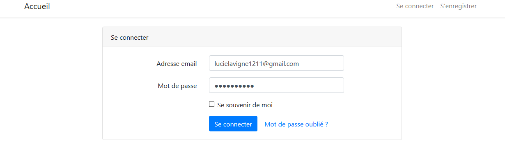
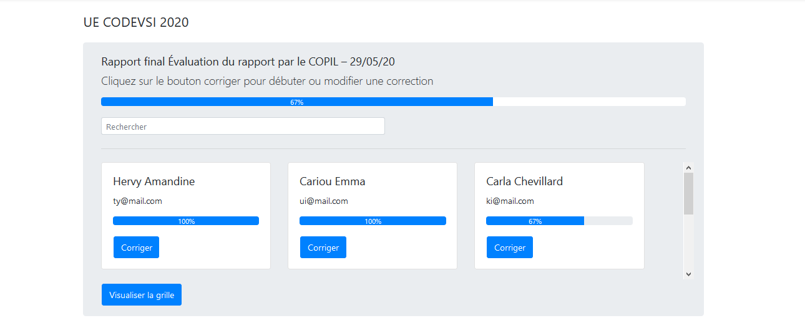
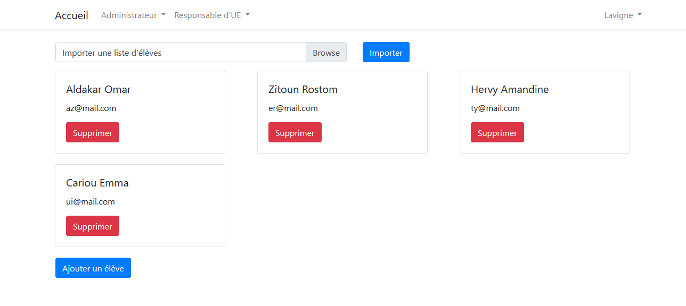

# Outil de saisie et de gestion des grilles critériées

Ce projet vise à aider les enseignants d'IMT Atlantique à évaluer les élèves sur la base de grilles critériées. Pour plus d'informations sur l'installation et les fonctionnalités mises en œuvre, consulter le rapport dans ce répertoire.

## Images

## Contributeurs

Lucie Lavigne
Rostom Zitoun
Omar Aldakar
